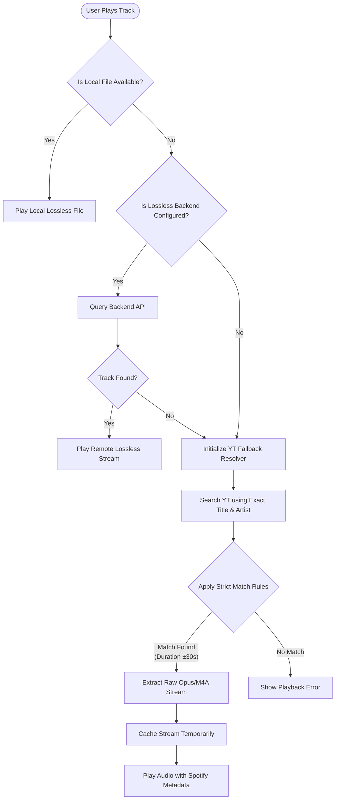
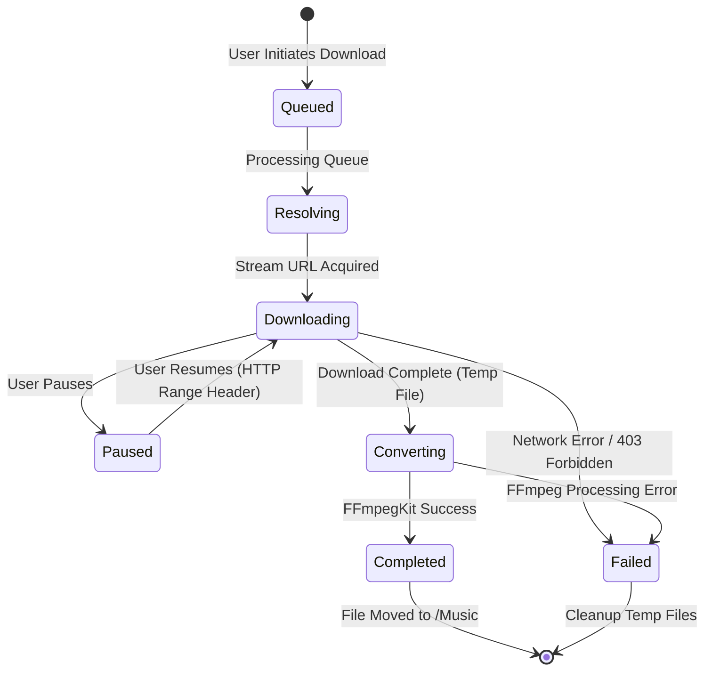

# Aetheris Audio Player

Aetheris is an advanced, modern, and unified music player built with Flutter. It seamlessly integrates local high-fidelity audio playback with cloud-based metadata streaming, bridging the gap between premium local playback and extensive online catalog discovery.

Aetheris utilizes a complex fallback mechanism to guarantee uninterrupted music playback. It resolves official Spotify metadata and attempts to map it against local lossless files, self-hosted lossless backends, or YouTube Music stream extractions as a last resort.

---

## Table of Contents
1. [Core Technologies](#core-technologies)
2. [Architecture & Design](#architecture--design)
3. [System Diagrams](#system-diagrams)
4. [Extensive Features Breakdown](#extensive-features-breakdown)
5. [Detailed Configuration Guide](#detailed-configuration-guide)
6. [Self-Hosted Lossless Backend](#self-hosted-lossless-backend)
7. [Build & Deployment Instructions](#build--deployment-instructions)
8. [Project Structure](#project-structure)
9. [Disclaimer](#disclaimer)

---

## Core Technologies

The Aetheris stack is carefully selected to provide high performance, clean state management, and reliable background processing.

### Frontend & UI
* **Flutter & Dart**: The core framework for building the cross-platform user interface natively compiled for Android.
* **Riverpod**: Utilized for robust, compile-safe, and scalable state management and dependency injection across the application.

### Audio & Playback Engine
* **Just Audio & Audio Service**: Handles low-level audio decoding, gapless playback, crossfading, and background audio execution.
* **Android MediaSession**: Native integration for lock-screen controls, Bluetooth metadata propagation, and external hardware controls.

### Data & Cloud Synchronization
* **Firebase Authentication**: Secures user identities using Email/Password and Google Sign-In.
* **Cloud Firestore**: Provides real-time, bi-directional synchronization for the user's music library, listening history, playlists, and settings.
* **SharedPreferences**: Manages local, persistent settings such as offline-mode toggles and onboarding states.

### Content Resolution & Processing
* **Spotify Web API**: Fetches rich metadata, artist profiles, album tracking, and recommendations via OAuth PKCE.
* **YouTube Explode Dart**: Acts as the primary audio fallback engine, extracting raw audio streams natively without web scrapers.
* **FFmpegKit**: A native C-compiled library embedded within the app for serverless, on-device audio transcoding and format packaging (FLAC, WAV, AAC, OPUS).

---

## Architecture & Design

Aetheris adheres to a Service-Oriented Architecture (SOA) integrated within a Clean Architecture boundary.

### 1. Presentation Layer
Located in `lib/pages` and `lib/widgets`. The UI strictly observes state from Riverpod providers (`ConsumerWidget` and `ConsumerStatefulWidget`). The UI is completely decoupled from business logic and does not contain raw API calls or database reads.

### 2. Provider / State Layer
Located in `lib/providers` and `lib/state`. Providers act as the glue between the UI and the underlying services. For example, `LibraryStateNotifier` aggregates data from local storage and Firestore to present a unified view of the user's saved tracks.

### 3. Service Layer
Located in `lib/services`. These singleton instances handle all heavy lifting:
* `SpotifyService`: Interacts with Spotify endpoints.
* `FirestoreSyncService`: Listens to Firestore snapshots and pushes local changes to the cloud.
* `DownloadManagerService`: Manages download queues, HTTP range requests, and interacts with the conversion layer.
* `PlayerController`: An orchestration layer that bridges `just_audio` state with `AetherisScope` to expose playback state to the application.

### 4. Offline-First Synchronization
Aetheris caches the library and recently played tracks locally. If the user launches the app without internet connectivity, the application enters Offline Mode. Once the device reconnects, the `FirestoreSyncService` triggers a background sync to resolve any discrepancies.

---

## System Diagrams

### Audio Stream Resolution Workflow
The following diagram illustrates how Aetheris resolves an audio track when a user presses "Play".



### Serverless Download Manager State Machine
This diagram shows the lifecycle of a download task.



---

## Extensive Features Breakdown

### Dynamic Recommendation Engine
The application records listening events (triggering after 30 seconds of playback). These events are synced to Firestore. The `HomePage` dynamically constructs Spotify API seed queries based on your recent listening history to generate a personalized "Made For You" feed that evolves alongside your taste.

### Advanced Serverless Download Manager
Aetheris does not rely on a central server to process audio downloads.
* **Direct Stream Extraction**: Bypasses rate limits by establishing direct TCP connections to audio servers.
* **Format Flexibility**: Downloads can be requested as `MP3`, `AAC`, `OPUS`, `OGG`, `FLAC`, or `WAV`.
* **Hardware Transcoding**: Uses `ffmpeg_kit_flutter` to transcode files directly on the Android processor.
* **Anti-Fake Lossless System**: Prevents upscaling an MP3 to FLAC and calling it lossless. The UI dynamically adjusts, ensuring the user is always aware of the source stream's true quality. Hi-Res formats are labeled strictly.

### Native Hardware Integration
* **Exclusive Mode DAC Bypass**: Instead of using standard Android AudioTrack downsampling, Aetheris utilizes a native MethodChannel to detect external USB DACs and Bluetooth LDAC codecs, ensuring bit-perfect audio delivery to audiophile equipment.

### Cross-Language Romanization
For fans of international music, Aetheris includes a built-in offline romanization engine. It dynamically converts Korean Hangul and Japanese Kana/Kanji within lyrics into Latin characters in real-time, aiding users who cannot read the native scripts.

---

## Detailed Configuration Guide

To build Aetheris from source, you must configure multiple third-party integrations.

### 1. Spotify Developer Configuration
Aetheris requires a Spotify Developer Application to fetch metadata.
1. Navigate to the [Spotify Developer Dashboard](https://developer.spotify.com/dashboard).
2. Create an App.
3. In the app settings, add your Android Package Name (e.g., `com.example.aetheris`) and your development/production SHA-1 fingerprint.
4. Add the OAuth Redirect URI: `aetheris://spotify-login`.
5. Copy your `Client ID` and `Client Secret`.

### 2. Firebase Project Setup
1. Go to the [Firebase Console](https://console.firebase.google.com/).
2. Create a new project and add an Android app using your package name.
3. Download the `google-services.json` file and place it in your local `android/app/` directory.
4. Navigate to **Authentication** and enable **Email/Password**.
5. Navigate to **Firestore Database** and create a new database.
6. Set up the following base security rules:

```javascript
rules_version = '2';
service cloud.firestore {
  match /databases/{database}/documents {
    match /users/{userId} {
      allow read, write: if request.auth != null && request.auth.uid == userId;
      
      match /{document=**} {
        allow read, write: if request.auth != null && request.auth.uid == userId;
      }
    }
  }
}
```

---

## Self-Hosted Lossless Backend

Aetheris supports pointing the application to a private NodeJS server hosting your personal FLAC/WAV music library. This provides a completely self-sovereign lossless streaming experience.

### Backend Setup
1. Open the `lossless_backend/` directory.
2. Run `npm install` to install dependencies.
3. Create a `.env` file or export the following variables:
   ```bash
   export MUSIC_DIR="/path/to/your/flac/collection"
   export API_KEY="your_secure_random_key"
   export PORT=3977
   ```
4. Run `npm start`.

The backend will recursively scan your music directory, extract ID3/FLAC metadata, and serve an index via HTTP. 

---

## Build & Deployment Instructions

Aetheris utilizes strict compile-time variables to inject sensitive API keys safely without hardcoding them into the repository.

### Running in Debug Mode
To run the application on an emulator or physical device during development:

```bash
flutter run \
  --dart-define=SPOTIFY_CLIENT_ID=your_client_id_here \
  --dart-define=SPOTIFY_CLIENT_SECRET=your_client_secret_here \
  --dart-define=TIDAL_API_URL=http://your_local_ip:3977 \
  --dart-define=TIDAL_API_KEY=your_backend_key
```

### Compiling for Release (APK)
Aetheris relies on native C libraries (FFmpegKit). When building for release, code minification and resource shrinking must be carefully managed to prevent the native JNI bindings from being obfuscated. This is already handled in `android/app/build.gradle.kts`.

To compile a production-ready APK:

```bash
flutter build apk --release \
  --dart-define=SPOTIFY_CLIENT_ID=your_client_id_here \
  --dart-define=SPOTIFY_CLIENT_SECRET=your_client_secret_here
```

The resulting artifact will be located at `build/app/outputs/flutter-apk/app-release.apk`.

---

## Project Structure

A brief overview of the directory structure to help developers navigate the repository.

```text
Aetheris Audio Player/
├── android/                 # Native Android build configurations and MethodChannels
├── lossless_backend/        # Optional NodeJS self-hosted lossless streaming server
├── lib/                     # Primary Dart source code
│   ├── app/                 # Root application wrapper and global listeners
│   ├── models/              # Immutable data models (Track, Album, UserProfile)
│   ├── pages/               # Flutter screens and UI layouts
│   ├── providers/           # Riverpod state management and dependency injection
│   ├── services/            # Core business logic and API integrations
│   │   ├── download/        # FFmpeg conversion and download queue management
│   │   ├── firebase/        # Firestore synchronization and Authentication
│   │   ├── music_sources/   # Pluggable audio resolution adapters
│   │   └── ...
│   ├── state/               # Scoped inherited notifiers (PlayerController)
│   ├── theme/               # Centralized color palettes and typography
│   └── widgets/             # Reusable UI components (TrackTile, AlbumArt)
├── test/                    # Unit and widget test suite
└── pubspec.yaml             # Dart dependencies and asset declarations
```

---

## Disclaimer

Aetheris is an independent, non-commercial software project developed strictly for educational and personal use. 
It interacts with public endpoints provided by Spotify and YouTube Music. Aetheris does not distribute copyrighted material, nor does it bypass Digital Rights Management (DRM) technologies. 
Users of this application are responsible for ensuring that their use complies with the terms of service of all connected third-party platforms. The developers assume no liability for misuse of this software.
