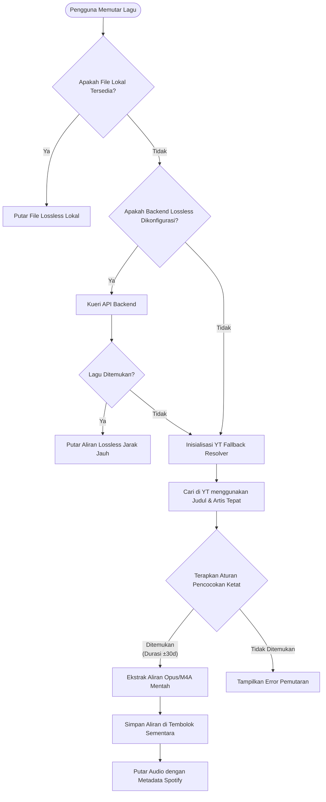
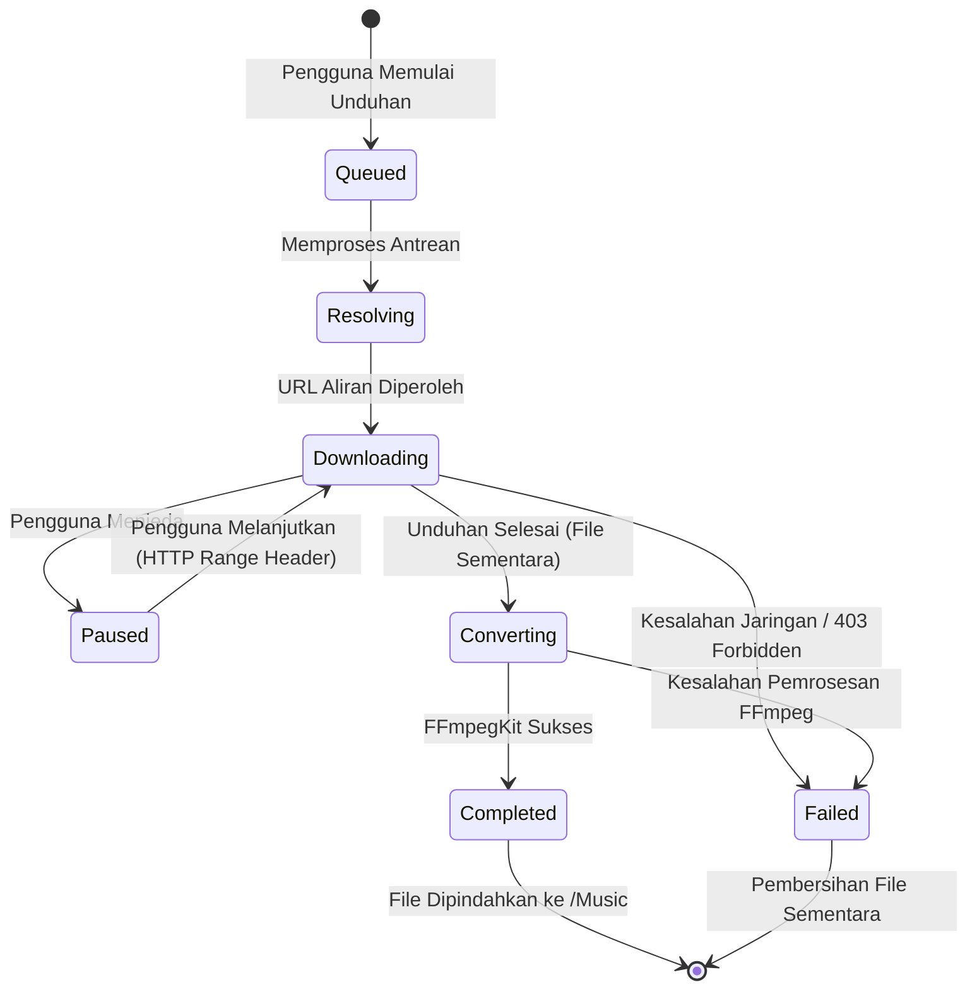

# Aetheris Audio Player

Aetheris adalah pemutar musik canggih, modern, dan terpadu yang dibangun menggunakan Flutter. Aplikasi ini mengintegrasikan pemutaran audio lokal beresolusi tinggi dengan streaming metadata berbasis cloud, menjembatani kesenjangan antara pemutaran audio lokal premium dengan penemuan katalog musik daring yang luas.

Aetheris menggunakan mekanisme fallback yang kompleks untuk menjamin pemutaran musik tanpa gangguan. Aplikasi ini memproses metadata resmi dari Spotify dan secara dinamis mencocokkannya dengan file lossless lokal, backend lossless mandiri, atau mengekstrak aliran suara dari YouTube Music sebagai upaya terakhir.

---

## Daftar Isi
1. [Teknologi Inti](#teknologi-inti)
2. [Arsitektur & Desain](#arsitektur--desain)
3. [Diagram Sistem](#diagram-sistem)
4. [Rincian Fitur Utama](#rincian-fitur-utama)
5. [Panduan Konfigurasi Detail](#panduan-konfigurasi-detail)
6. [Backend Lossless Mandiri](#backend-lossless-mandiri-self-hosted)
7. [Panduan Build & Deployment](#panduan-build--deployment)
8. [Struktur Proyek](#struktur-proyek)
9. [Penafian](#penafian)

---

## Teknologi Inti

Teknologi di balik Aetheris dipilih secara saksama untuk memberikan performa tinggi, manajemen state yang rapi, dan pemrosesan latar belakang yang andal.

### Frontend & UI
* **Flutter & Dart**: Framework utama untuk membangun antarmuka pengguna lintas platform yang dikompilasi secara native untuk Android.
* **Riverpod**: Digunakan untuk manajemen state yang kuat, aman pada saat kompilasi, serta dependency injection di seluruh aplikasi.

### Audio & Mesin Pemutaran
* **Just Audio & Audio Service**: Menangani decoding audio tingkat rendah, pemutaran tanpa jeda (gapless), crossfading, dan eksekusi audio di latar belakang.
* **Android MediaSession**: Integrasi native untuk kontrol layar kunci, propagasi metadata Bluetooth, dan kontrol perangkat keras eksternal.

### Data & Sinkronisasi Cloud
* **Firebase Authentication**: Mengamankan identitas pengguna menggunakan Email/Password dan Google Sign-In.
* **Cloud Firestore**: Menyediakan sinkronisasi dua arah secara real-time untuk perpustakaan musik pengguna, riwayat pemutaran, daftar putar, dan pengaturan.
* **SharedPreferences**: Mengelola pengaturan lokal yang persisten seperti tombol mode luring (offline) dan status orientasi awal (onboarding).

### Resolusi Konten & Pemrosesan
* **Spotify Web API**: Mengambil metadata yang kaya, profil artis, pelacakan album, dan rekomendasi melalui OAuth PKCE.
* **YouTube Explode Dart**: Berfungsi sebagai mesin fallback audio utama, mengekstrak aliran audio mentah secara native tanpa menggunakan web scraper.
* **FFmpegKit**: Pustaka kompilasi C-native yang disematkan di dalam aplikasi untuk melakukan transkoding audio dan pengemasan format (FLAC, WAV, AAC, OPUS) langsung di perangkat pengguna tanpa memerlukan server.

---

## Arsitektur & Desain

Aetheris mematuhi prinsip Service-Oriented Architecture (SOA) yang terintegrasi di dalam batas Clean Architecture.

### 1. Lapisan Presentasi
Terletak di `lib/pages` dan `lib/widgets`. Antarmuka pengguna (UI) secara ketat mengamati state dari provider Riverpod (`ConsumerWidget` dan `ConsumerStatefulWidget`). UI sepenuhnya dipisahkan dari logika bisnis dan tidak mengandung panggilan API mentah atau pembacaan basis data secara langsung.

### 2. Lapisan Provider / State
Terletak di `lib/providers` dan `lib/state`. Provider bertindak sebagai perekat antara UI dan layanan yang mendasarinya. Sebagai contoh, `LibraryStateNotifier` mengumpulkan data dari penyimpanan lokal dan Firestore untuk menyajikan tampilan perpustakaan pengguna yang selaras.

### 3. Lapisan Layanan (Service)
Terletak di `lib/services`. Instans singleton ini menangani semua beban kerja utama:
* `SpotifyService`: Berinteraksi dengan endpoint Spotify.
* `FirestoreSyncService`: Mendengarkan perubahan snapshot Firestore dan mendorong perubahan lokal ke cloud.
* `DownloadManagerService`: Mengelola antrean unduhan, permintaan rentang HTTP (HTTP range requests), dan berinteraksi dengan lapisan konversi.
* `PlayerController`: Lapisan orkestrasi yang menjembatani state dari `just_audio` dengan `AetherisScope` untuk mengekspos status pemutaran ke aplikasi.

### 4. Sinkronisasi Offline-First
Aetheris menyimpan tembolok (cache) perpustakaan dan lagu yang baru saja diputar secara lokal. Jika pengguna membuka aplikasi tanpa koneksi internet, aplikasi akan masuk ke Mode Offline. Begitu perangkat kembali terhubung, `FirestoreSyncService` akan memicu sinkronisasi latar belakang untuk menyelesaikan segala perbedaan data.

---

## Diagram Sistem

### Alur Resolusi Aliran Audio
Diagram berikut mengilustrasikan bagaimana Aetheris memproses dan menemukan jalur audio saat pengguna menekan tombol "Play".



### State Machine Pengelola Unduhan Tanpa Server
Diagram ini menunjukkan siklus hidup dari sebuah tugas unduhan.



---

## Rincian Fitur Utama

### Mesin Rekomendasi Dinamis
Aplikasi merekam peristiwa mendengarkan (dipicu setelah 30 detik pemutaran). Peristiwa ini disinkronkan ke Firestore. `HomePage` secara dinamis membangun kueri bibit (seed queries) API Spotify berdasarkan riwayat mendengarkan Anda untuk menghasilkan beranda "Made For You" yang dipersonalisasi dan berkembang bersama selera Anda.

### Pengelola Unduhan Tingkat Lanjut Tanpa Server
Aetheris tidak bergantung pada server terpusat untuk memproses unduhan audio.
* **Ekstraksi Aliran Langsung**: Menembus batas kecepatan dengan membangun koneksi TCP langsung ke server audio.
* **Fleksibilitas Format**: Unduhan dapat diatur dalam bentuk `MP3`, `AAC`, `OPUS`, `OGG`, `FLAC`, atau `WAV`.
* **Transkoding Perangkat Keras**: Menggunakan `ffmpeg_kit_flutter` untuk melakukan transkoding file langsung pada prosesor Android.
* **Sistem Anti-Fake Lossless**: Mencegah peningkatan kualitas paksa (upscaling) dari MP3 ke FLAC untuk mengklaim sebagai lossless. UI secara dinamis menyesuaikan diri, memastikan pengguna selalu mengetahui kualitas sebenarnya dari aliran sumber. Format Hi-Res diberi label secara ketat.

### Integrasi Perangkat Keras Native
* **Bypass DAC Mode Eksklusif**: Daripada menggunakan downsampling AudioTrack Android standar, Aetheris memanfaatkan MethodChannel native untuk mendeteksi DAC USB eksternal dan codec Bluetooth LDAC, memastikan pengiriman audio bit-perfect ke peralatan audiophile.

### Romanisasi Lintas Bahasa
Bagi penggemar musik internasional, Aetheris dilengkapi dengan mesin romanisasi lirik offline bawaan. Mesin ini secara dinamis mengonversi Hangul Korea serta Kana/Kanji Jepang di dalam lirik menjadi karakter Latin secara real-time, membantu pengguna yang tidak dapat membaca skrip aslinya.

---

## Panduan Konfigurasi Detail

Untuk membangun Aetheris dari source code, Anda harus mengonfigurasi beberapa integrasi pihak ketiga.

### 1. Konfigurasi Developer Spotify
Aetheris membutuhkan Aplikasi Developer Spotify untuk mengambil metadata.
1. Navigasi ke [Spotify Developer Dashboard](https://developer.spotify.com/dashboard).
2. Buat sebuah Aplikasi (Create an App).
3. Di pengaturan aplikasi, tambahkan Nama Paket Android Anda (contoh: `com.example.aetheris`) dan sidik jari SHA-1 pengembangan/produksi Anda.
4. Tambahkan OAuth Redirect URI: `aetheris://spotify-login`.
5. Salin `Client ID` dan `Client Secret` Anda.

### 2. Setup Proyek Firebase
1. Pergi ke [Firebase Console](https://console.firebase.google.com/).
2. Buat proyek baru dan tambahkan aplikasi Android menggunakan nama paket Anda.
3. Unduh file `google-services.json` dan letakkan di dalam direktori `android/app/` lokal Anda.
4. Navigasi ke **Authentication** dan aktifkan **Email/Password**.
5. Navigasi ke **Firestore Database** dan buat basis data baru.
6. Siapkan aturan keamanan (security rules) dasar berikut:

```javascript
rules_version = '2';
service cloud.firestore {
  match /databases/{database}/documents {
    match /users/{userId} {
      allow read, write: if request.auth != null && request.auth.uid == userId;
      
      match /{document=**} {
        allow read, write: if request.auth != null && request.auth.uid == userId;
      }
    }
  }
}
```

---

## Backend Lossless Mandiri (Self-Hosted)

Aetheris mendukung penyambungan aplikasi ke server NodeJS pribadi yang menyimpan koleksi musik FLAC/WAV Anda. Hal ini memberikan pengalaman streaming lossless yang sepenuhnya berdaulat tanpa bergantung pada fallback streaming lossy.

### Setup Backend
1. Buka direktori `lossless_backend/`.
2. Jalankan `npm install` untuk menginstal dependensi.
3. Buat file `.env` atau ekspor variabel berikut:
   ```bash
   export MUSIC_DIR="/jalur/ke/koleksi/flac/anda"
   export API_KEY="kunci_acak_rahasia_anda"
   export PORT=3977
   ```
4. Jalankan `npm start`.

Backend akan memindai direktori musik Anda secara rekursif, mengekstrak metadata ID3/FLAC, dan menyajikan indeks melalui HTTP.

---

## Panduan Build & Deployment

Aetheris menggunakan variabel waktu kompilasi (compile-time variables) yang ketat untuk menyuntikkan kunci API sensitif dengan aman tanpa menulisnya langsung ke dalam kode sumber (hardcoding).

### Menjalankan dalam Mode Debug
Untuk menjalankan aplikasi pada emulator atau perangkat fisik selama pengembangan:

```bash
flutter run \
  --dart-define=SPOTIFY_CLIENT_ID=client_id_anda \
  --dart-define=SPOTIFY_CLIENT_SECRET=client_secret_anda \
  --dart-define=TIDAL_API_URL=http://ip_lokal_anda:3977 \
  --dart-define=TIDAL_API_KEY=kunci_backend_anda
```

### Mengompilasi untuk Rilis (APK)
Aetheris bergantung pada pustaka C native (FFmpegKit). Saat membangun untuk rilis, minifikasi kode dan pengecilan sumber daya (resource shrinking) harus dikelola dengan hati-hati untuk mencegah ikatan JNI native menjadi tersamarkan (obfuscated). Hal ini telah ditangani di dalam file `android/app/build.gradle.kts`.

Untuk mengompilasi APK siap produksi:

```bash
flutter build apk --release \
  --dart-define=SPOTIFY_CLIENT_ID=client_id_anda \
  --dart-define=SPOTIFY_CLIENT_SECRET=client_secret_anda
```

Artifak yang dihasilkan akan berlokasi di `build/app/outputs/flutter-apk/app-release.apk`.

---

## Struktur Proyek

Gambaran singkat mengenai struktur direktori untuk membantu developer menavigasi repository.

```text
Aetheris Audio Player/
├── android/                 # Konfigurasi build Android native dan MethodChannels
├── lossless_backend/        # Server NodeJS opsional untuk streaming lossless mandiri
├── lib/                     # Kode sumber utama Dart
│   ├── app/                 # Wrapper root aplikasi dan pendengar global (global listeners)
│   ├── models/              # Model data yang tidak dapat diubah (Track, Album, UserProfile)
│   ├── pages/               # Tampilan layar Flutter dan tata letak UI
│   ├── providers/           # Manajemen state Riverpod dan dependency injection
│   ├── services/            # Logika bisnis inti dan integrasi API
│   │   ├── download/        # Konversi FFmpeg dan manajemen antrean unduhan
│   │   ├── firebase/        # Sinkronisasi Firestore dan Otentikasi
│   │   ├── music_sources/   # Adaptor resolusi audio yang dapat dipasang-lepas
│   │   └── ...
│   ├── state/               # Pemberitahu pewarisan tertutup (PlayerController)
│   ├── theme/               # Palet warna terpusat dan tipografi
│   └── widgets/             # Komponen UI yang dapat digunakan kembali (TrackTile, AlbumArt)
├── test/                    # Suite pengujian unit dan widget
└── pubspec.yaml             # Deklarasi dependensi Dart dan aset
```

---

## Penafian

Aetheris adalah proyek perangkat lunak non-komersial independen yang dikembangkan sepenuhnya untuk tujuan pendidikan dan penggunaan pribadi.
Aplikasi ini berinteraksi dengan endpoint publik yang disediakan oleh Spotify dan YouTube Music. Aetheris tidak mendistribusikan materi berhak cipta, dan tidak meretas atau mem-bypass teknologi Manajemen Hak Digital (Digital Rights Management / DRM).
Pengguna aplikasi ini bertanggung jawab penuh untuk memastikan bahwa penggunaan mereka mematuhi persyaratan layanan dari semua platform pihak ketiga yang terhubung. Para pengembang tidak bertanggung jawab atas penyalahgunaan perangkat lunak ini.
